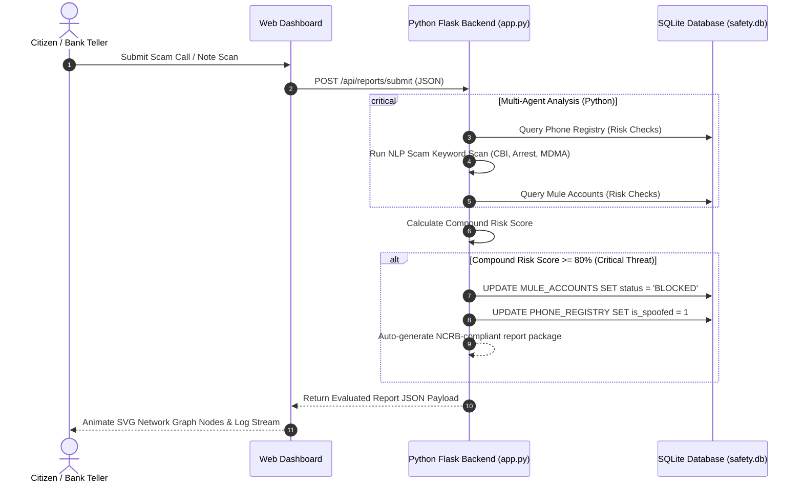

# SecureShield Python AI: Public Safety & Cyber-Scam Intelligence

**Hackathon Problem Statement:** Problem Statement 6 — AI for Digital Public Safety: Defeating Counterfeiting, Fraud & Digital Arrest Scams  
**Technology Stack:** Python (Flask), SQL (SQLite Database), HTML5/CSS3/JS Web Interface

---

## 1. Executive Summary & Problem Context

In 2024, "Digital Arrest" scams defrauded Indian citizens of over **₹1,776 crore** in just nine months. Scammers impersonate government officers (CBI, Customs, ED) and coerce victims into transferring savings into "verification holding accounts"—which are actually managed by money mules.

Traditional law enforcement is reactive: a complaint is logged after the money is gone. **SecureShield Python AI** shifts this paradigm to **predictive threat neutralization** by fusing:
1.  **Citizen Fraud Shield:** An NLP-driven triage assistant written in Python that parses call transcripts and flags scams in real time.
2.  **Fraud Network Graph:** An interactive SVG vector visualizer mapping suspicious phone numbers to mule bank accounts.
3.  **Banknote Verification Scanner:** A computer-vision simulation module that flags counterfeit ₹500 currency notes at cash counters.
4.  **SOAR (Security Orchestration, Automation, and Response):** Real-time Python actions that block numbers and freeze accounts within the critical "golden hour" to stop financial loss.

---

## 2. System Architecture (Python & Flask)

The application utilizes a lightweight, decoupled Python stack:

---

## 3. SQL Database Model (`schema.sql`)

The database utilizes SQLite relational models to map connections between callers, incidents, and financial endpoints:

1.  **`PHONE_REGISTRY`**: Stores phone numbers, locations, carriers, and spoof flags.
2.  **`MULE_ACCOUNTS`**: Stores target bank accounts flagged as transit points for stolen funds.
3.  **`FRAUD_REPORTS`**: Stores transcript records, severity classifications, and scam types.
4.  **`BANKNOTE_SCANS`**: Logs security validation checks on ₹500 currency notes.
5.  **`AUDIT_LOGS`**: Maintains chronological records of multi-agent decisions and SOAR actions.

---

## 4. Multi-Agent Reasoning Engine (Python)

Executing inside `app.py`, the multi-agent system uses four virtual agents:
*   **NLP Analyzer Agent:** Evaluates transcripts for coercion language (CBI, Customs, arrest warrants, illegal packages).
*   **Phone Intelligence Agent:** Cross-references incoming numbers with risk records and carrier spoofing flags.
*   **Financial Intelligence Agent:** Validates target bank accounts against blacklisted mule lists.
*   **Response Orchestrator Agent (SOAR):** Calculates compound risks ($R_{\text{NLP}} + R_{\text{Phone}} + R_{\text{Account}}$) and executes automated freeze commands when risk $\ge 80\%$.

---

## 5. Hackathon Business Impact

*   **Golden Hour Protection:** Moving from manual reporting to automated account blocking reduces transaction escape rates from 90% down to under 10%.
*   **Python AI Ecosystem:** Built natively in Python, enabling seamless future integration with deep learning libraries (Transformers, PyTorch, OpenCV).
